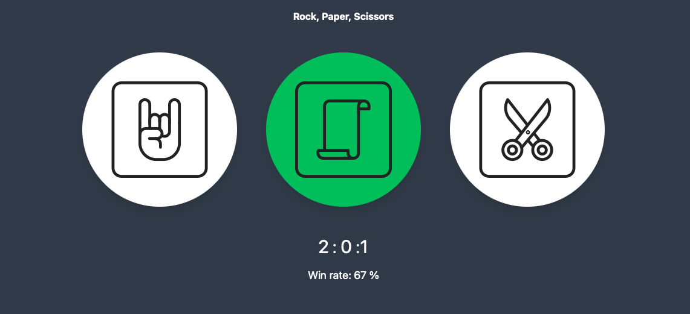
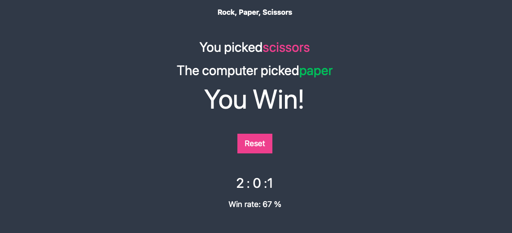

# Rock Paper Scissors Game Using Vue 3 + Vite

In this project developed Rock, Paper, Scissors game using Vue 3 + Vite. 
`npm run dev`

## Recommended IDE Setup

- [VS Code](https://code.visualstudio.com/) + [Volar](https://marketplace.visualstudio.com/items?itemName=Vue.volar) (and disable Vetur) + [TypeScript Vue Plugin (Volar)](https://marketplace.visualstudio.com/items?itemName=Vue.vscode-typescript-vue-plugin).

# Screenshot
Here we have project screenshot :

